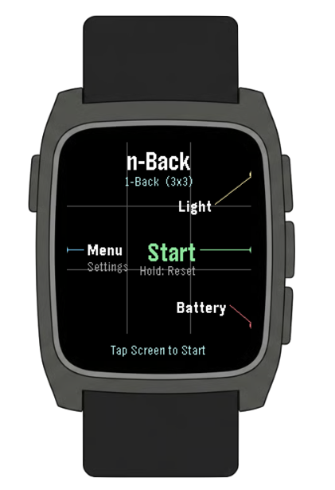

# nBack: Advanced Working Memory Training (Emery Platform)

  

## Overview

**nBack** is an ultra-precise, multimodal cognitive working memory training application designed exclusively for **Pebble Time 2 (Emery Platform)**. It harnesses the full capabilities of Emery's hardware—200×228 64-color Sharp MIP LCD, capacitive touchscreen, tactile 4-button input, and built-in raw tone generator—to deliver rigorous Dual, Triple, and Multi-modal $n$-Back challenges conforming to modern cognitive science standards.

- **AppStore nBack Page**: [https://apps.repebble.com/0fa107ae30f643e2b551a71b](https://apps.repebble.com/0fa107ae30f643e2b551a71b)

---

## Key Features

- **Multi-Modal Stimuli**:
  - **Position** (3×3 Grid spatial coordinate memory)
  - **Color** (6-Color distinct palette recognition)
  - **Shape** (10 Distinct geometric primitives rendered via GContext)
  - **Number** (1–9 Digit recall)
  - **Letter** (8-Letter phonetic working memory)
  - **Vibration** (Haptic pulse pattern matching)
  - **Audio** (Morse tone sound synthesis)
- **Adaptive Auto-Leveling**: Automatically adjusts $n$-Back difficulty ($n=1$ to $n=7$) based on real-time performance thresholds.
- **Strict FSM Architecture**: Zero state-bypass execution model guaranteeing lifecycle purity and instant responsiveness.
- **OPFS Local Sandbox**: Training session histories and player profiles are saved inside the mobile browser's **Origin Private File System (OPFS)** for private, robust local storage.
- **Global Leaderboard Sync**: Upload authenticated cognitive scores via explicit `PUT` requests to the global competitive leaderboard (`https://andrwj.com/pebble-nback-watchapp`).

---

## Configuration & Leaderboard Web App

The mobile settings page is hosted on GitHub Pages:
- **URL**: `https://andrwj.github.io/pebble-nback-watchapp/settings.html`
- **Features**:
  - Player Nickname management & Pebble Device UUID verification.
  - Interactive training dashboard with peak $n$-Back level, average accuracy %, and session breakdown.
  - One-click explicit score publishing to the global leaderboard. (Not yet.)
  - Multi-language support (English / Korean).

---

## Target Platform Specifications

| Specification     | Details                                                                        |
| :---------------- | :----------------------------------------------------------------------------- |
| **Target Device** | Pebble Time 2 (Emery)                                                          |
| **Display**       | 200 × 228 pixels, 64-Color MIP LCD                                             |
| **Sensors & I/O** | 4 Physical Buttons, Capacitive Touchscreen, 3D Accelerometer, Built-in Speaker |
| **RAM Footprint** | ~27 KB (Well below the 32 KB threshold)                                        |

---

## License & Author

- **Author**: A.J (`andrwj@gmail.com`)
- **Repository**: [git@github.com:andrwj/pebble-nback-watchapp.git](https://github.com/andrwj/pebble-nback-watchapp)
